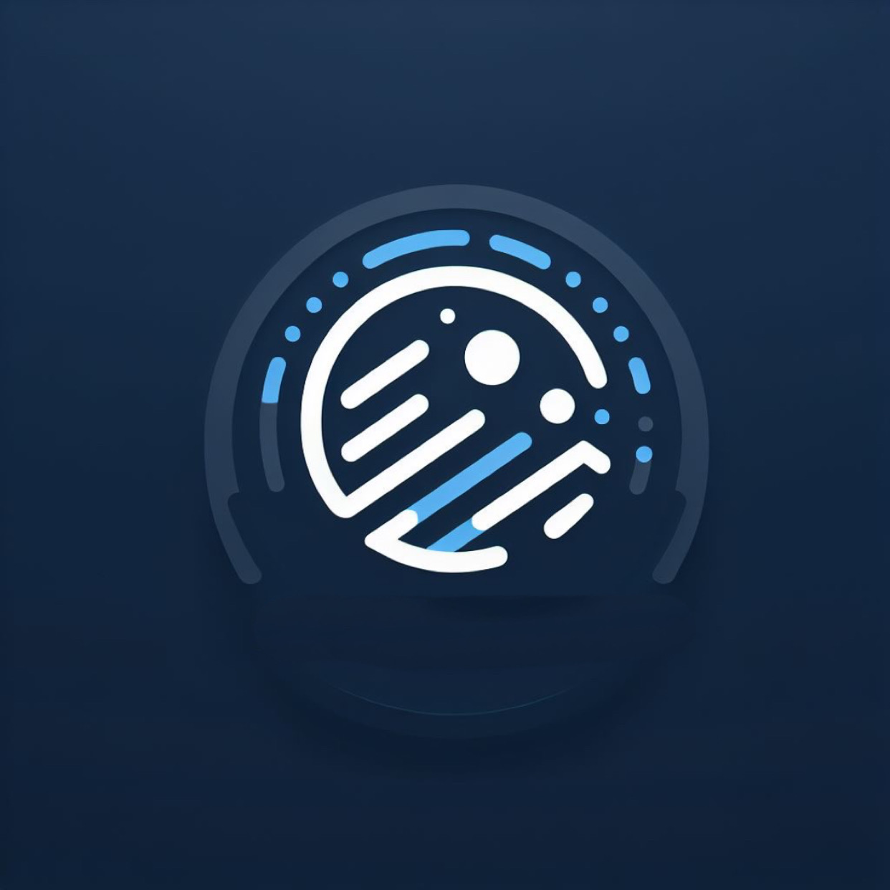

# SignSense - ASL Recognition for Medical Use

SignSense is an innovative web application that provides real-time American Sign Language (ASL) recognition specifically designed for medical environments. The application helps bridge communication gaps between deaf/hard-of-hearing patients and healthcare providers.



## 🌟 Features

- **Real-time ASL Recognition**: Live video processing for instant sign language interpretation
- **Medical Focus**: Optimized for healthcare communication scenarios
- **Webcam Integration**: Seamless access to camera for video input
- **Clean UI**: Modern, accessible interface built with React and Tailwind CSS
- **Text Display**: Clear presentation of recognized ASL translations
- **WebSocket Support**: Real-time communication with backend recognition services

## 🛠️ Technology Stack

- **Frontend**: React 19 with Vite
- **Styling**: Tailwind CSS 4.0
- **Build Tool**: Vite 6.1
- **Linting**: ESLint 9.19
- **Language**: JavaScript (ES6+)

## 📋 Prerequisites

Before you begin, ensure you have the following installed:
- Node.js (version 16 or higher)
- npm (comes with Node.js)
- A modern web browser with webcam access
- Camera permissions for your browser

## 🚀 Getting Started

### Installation

1. Clone the repository:
```bash
git clone <repository-url>
cd SignSense/ASLProject
```

2. Install dependencies:
```bash
npm install
```

3. Start the development server:
```bash
npm run dev
```

4. Open your browser and navigate to `http://localhost:5173`

### Available Scripts

- `npm run dev` - Start development server with hot reload
- `npm run build` - Build for production
- `npm run preview` - Preview production build locally
- `npm run lint` - Run ESLint for code quality checks

## 🏗️ Project Structure

```
ASLProject/
├── src/
│   ├── components/
│   │   ├── ASLRecognition.jsx    # Main ASL recognition component
│   │   ├── VideoFeed.jsx         # Video capture component
│   │   ├── TextDisplay.jsx       # Text output display
│   │   ├── Controls.jsx          # User controls
│   │   └── ui/
│   │       └── Button.jsx        # Reusable UI components
│   ├── hooks/
│   │   ├── useASLRecognition.js  # ASL recognition logic
│   │   └── useWebcam.js          # Webcam management
│   ├── services/
│   │   └── aslRecognitionService.js  # WebSocket service
│   ├── pages/
│   │   ├── Home.jsx              # Home page component
│   │   └── Settings.jsx          # Settings page
│   ├── assets/
│   │   └── SSlogo.png            # SignSense logo
│   ├── App.jsx                   # Main application component
│   └── main.jsx                  # Application entry point
├── public/
├── package.json
└── README.md
```

## 🔧 Configuration

### Backend Integration

To connect to your ASL recognition backend service, update the WebSocket URL in `src/services/aslRecognitionService.js`:

```javascript
const socket = new WebSocket("ws://your-backend-url");
```

Replace `"ws://your-backend-url"` with your actual backend WebSocket endpoint.

### Camera Permissions

The application requires camera access to function properly. Ensure your browser allows camera permissions for the application domain.

## 🎯 Usage

1. **Grant Camera Access**: When prompted, allow the application to access your camera
2. **Start Recognition**: The application will automatically start processing video input
3. **Sign Communication**: Perform ASL signs in front of the camera
4. **View Results**: Recognized text will appear in the display area below the video
5. **Clear Text**: Use the "Clear Text" button to reset the recognition display

## 🧩 Components Overview

### ASLRecognition
The main component that handles video capture and displays recognition results. Features a clean card-based layout with integrated controls.

### VideoFeed
Manages webcam access and video stream display with error handling for camera access issues.

### TextDisplay
Presents recognized ASL text in a formatted, readable manner with real-time updates.

### Controls
Provides user interface controls for managing the recognition process and clearing results.

## 🔮 Future Enhancements

- **Multi-language Support**: Support for multiple sign languages
- **Voice Synthesis**: Audio output of recognized text
- **Medical Vocabulary**: Enhanced recognition for medical terminology
- **Session Recording**: Save and review recognition sessions
- **Offline Mode**: Local processing capabilities
- **Mobile Optimization**: Enhanced mobile device support

## 🤝 Contributing

We welcome contributions to SignSense! Please feel free to submit issues, feature requests, or pull requests.

1. Fork the repository
2. Create a feature branch
3. Make your changes
4. Add tests if applicable
5. Submit a pull request

## 📄 License

This project is part of a hackathon development effort focused on improving accessibility in healthcare communication.

## 🆘 Support

If you encounter any issues or have questions about SignSense, please:
1. Check the browser console for error messages
2. Ensure camera permissions are granted
3. Verify your internet connection for WebSocket functionality
4. Create an issue in the repository for bugs or feature requests

## 🙏 Acknowledgments

- Built during a hackathon with focus on healthcare accessibility
- Designed to improve communication between deaf/hard-of-hearing patients and healthcare providers
- Utilizes modern web technologies for optimal performance and user experience

---

**SignSense** - Breaking down communication barriers in healthcare, one sign at a time.